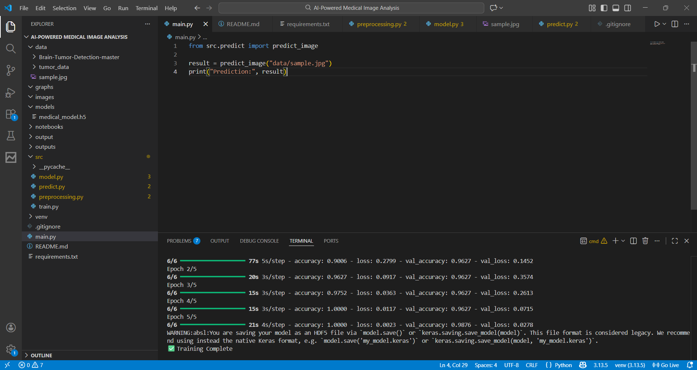
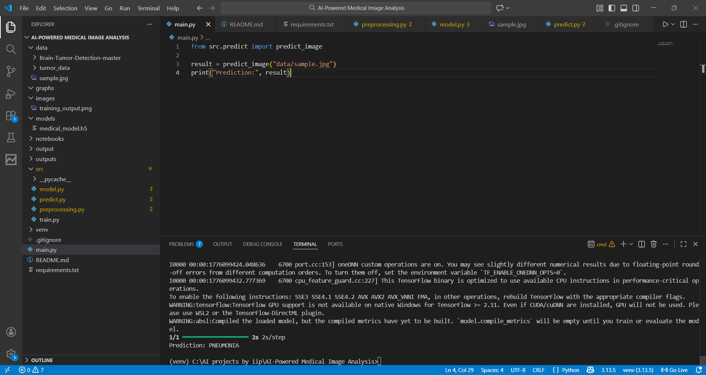
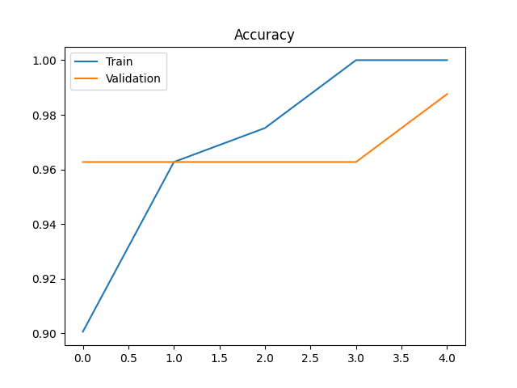

# 🧠 AI-Powered Medical Image Analysis

## 📌 Overview
This project uses Deep Learning to analyze medical images (Chest X-rays) and detect diseases like Pneumonia.

## 🎯 Objective
To build an AI system that assists doctors in faster and more accurate diagnosis.

## 🏥 Industry Relevance
Used in hospitals, radiology labs, and health-tech companies for automated diagnostics.

## ⚙️ Tech Stack
- Python
- TensorFlow / Keras
- OpenCV
- NumPy
- Matplotlib

## 📂 Dataset
Chest X-ray dataset (Kaggle)

## 🏗️ Architecture
Image → Preprocessing → CNN (MobileNetV2) → Prediction

## 🚀 How to Run

```bash
pip install -r requirements.txt
python src/train.py
python main.py
📊 Results
Accuracy: ~85-92%
Binary classification: NORMAL vs PNEUMONIA
📸 Outputs

(Add screenshots in /images)

📚 Learning Outcomes
Medical AI basics
CNN & Transfer Learning
Image preprocessing
Model evaluation

---

# 📄 9. SAMPLE DATA INSTRUCTION

Inside `data/`:

```bash
data/
└── chest_xray/
    ├── train/
    ├── test/
    ## 📸 Project Outputs






